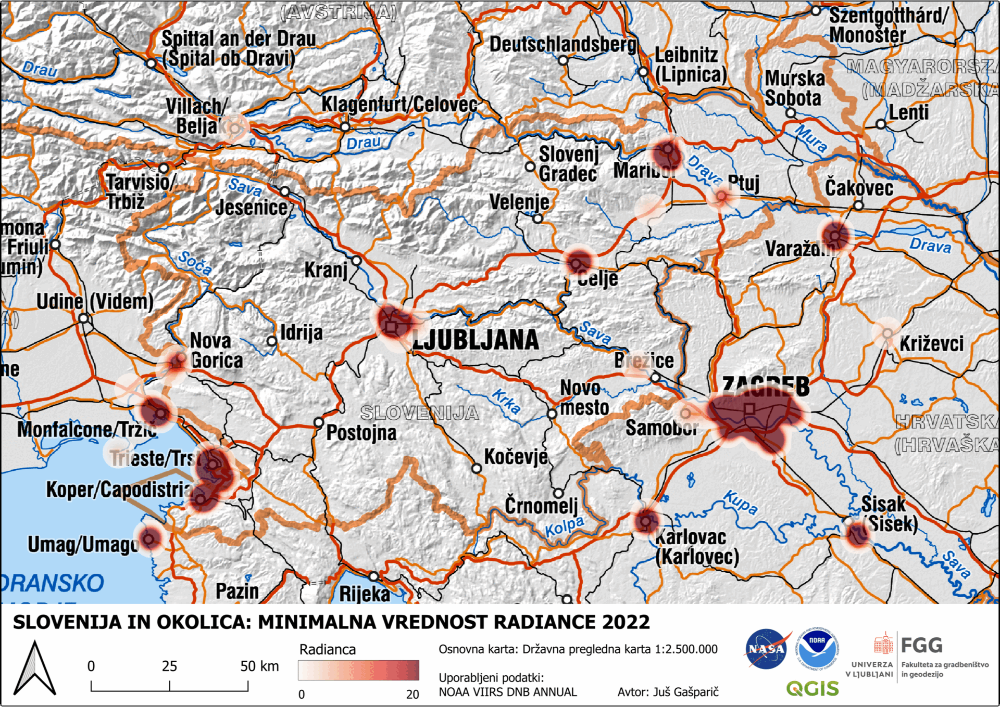

# 🌍 Statistične vrednosti radianc v Sloveniji in okolici (2022)

Ta repozitorij vsebuje vizualizacijo **minimalnih, povrepnih in maksimalnih vrednosti radiance** v Sloveniji in okolici za leto **2022**. 

## 📌 Animacija svetlobne onesnaženosti

---

### <h2 align="center"><b>Slovenija in okolica 2022</b></h2>

    

---

## 🔗 Povezave
🌍 [NASA Earthdata - Nighttime Lights](https://www.earthdata.nasa.gov/topics/human-dimensions/nighttime-lights)  
🌍 [NASA Worldview](https://worldview.earthdata.nasa.gov/?)
🌍 [Temno Nebo Slovenija](http://www.temnonebo.si/)  
